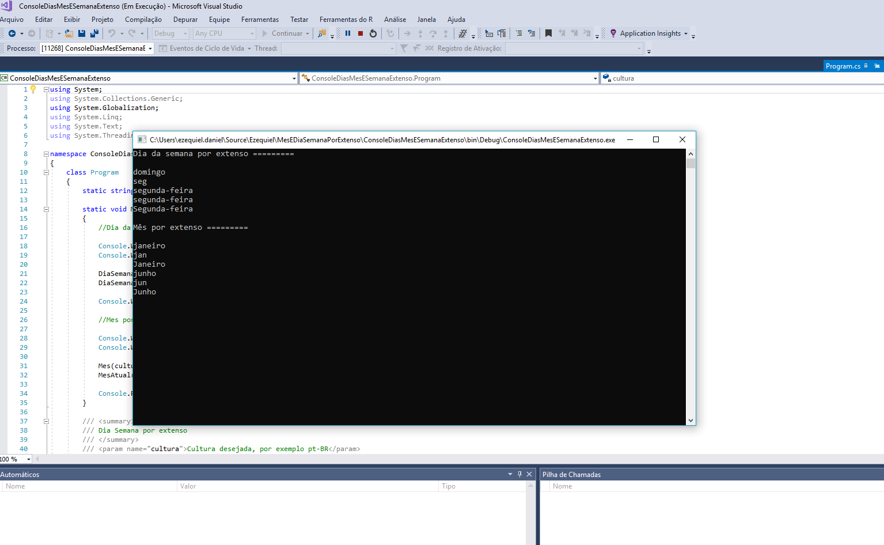
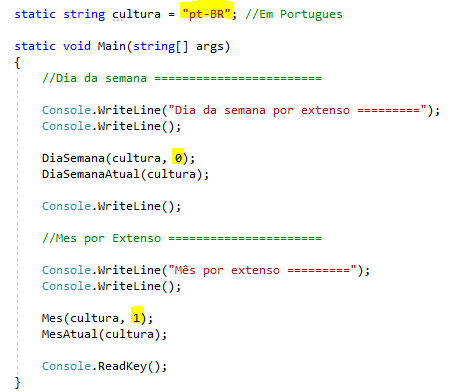

# Apresentação

Este projeto tem a finalidade de exemplificar como obter o dia da semana e o mês por extenso, conforme a globalização passada para os métodos. Neste projeto foi utilizado como exemplo o "pt-BR".

# Requisitos

Para executar o programa deve abrir a solução primeiramente com o Visual Studio 2017:
* Ter Windows instalado, qualquer versão.
* Ter o Framework .Net 4.6.1 instalado.
* Ter o Microsoft Visual Studio Community 2017.

# Instalação

Não se aplica.

# Como utilizar

Basta abrir a solução pelo Visual Studio e executar em modo DEBUG.

Para alterar o dia da semana ou mes ou idioma, basta alterar os pontos marcados, que é o numero da semana, numero do mes ou o código da globalização.

Ao executar, no console, é apresentado o dia da semana e o mês por extenso de tres formas diferentes: por extenso, por extenso com a primeira letra em maiúsculo e por extenso abreviado.

# Autor

Ezequiel da Silva Daniel  
[Blog](https://ezequieldaniel.wordpress.com/)  
[Email](ezequielsd@gmail.com)

# Licença

[MIT]
